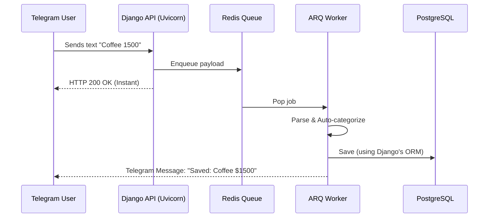

# SmartExpense 

> A seamless personal finance ecosystem combining the immediacy of a Telegram Bot with the analytical power of a modern web dashboard, driven by asynchronous processing and AI-assisted categorization.
> You can find it on telegram! [@your_smartexpense_bot](https://web.telegram.org/a/#8478720243)

> This README has been made with the help of Gemini Pro, I edited the relevants sections and decided to keep some of the emojis because it looks good.  


---

## Key Features

* **Natural Language Processing:** Log expenses conversationally via Telegram (e.g., *"Pizza 2000"*, *"Uber with a friend 5500", "2 cokes 3.500", "1500,50 snacks"*).
* **Smart Auto-Categorization:** Built-in heuristic engine that analyzes user history to automatically assign expense categories.
* **Asynchronous High-Availability:** Non-blocking architecture ensuring the Telegram Bot remains responsive even under heavy load.
* **Real-Time Dashboard:** A sleek React-based web interface for visual financial analysis.
* **Magic Link Authentication:** Secure, passwordless login to the web dashboard directly from Telegram.

---

## 🏛️ System Architecture

To ensure high performance and avoid blocking the ASGI event loop during heavy NLP or database writes, the system implements a **Producer/Consumer asynchronous pattern** 

### The Message Lifecycle

1. **Telegram API** sends a payload via Webhook.
2. **Uvicorn (ASGI)** receives the HTTP POST request in the Django Ninja API.
3. The API instantly enqueues the payload into **Redis** and returns a `200 OK` to Telegram, closing the HTTP cycle in milliseconds.
4. The **ARQ Worker** (running in a separate background process) pops the job from Redis.
5. The Worker executes the key-match categorization, saves the record in **PostgreSQL** using Django's ORM and sends the confirmation back to the user.



## 🛠️ Design Decisions & Engineering 

* **Why Django Ninja + Uvicorn?** Transitioning from standard Django views to `django-ninja` running on `uvicorn` allows us to leverage Python's `async/await` ecosystem natively. It provides Pydantic validation (V2) and maintains a persistent Event Loop for optimal Redis connection pooling.
* **Why ARQ over Celery?** For an I/O bound application relying heavily on `asyncio`, ARQ provides a drastically lighter, faster, and native async job queue over Redis compared to legacy Celery setups.
* **Hybrid Development Environment:** The project is structured to run the application logic locally (for immediate auto-reloading and direct OS hardware access) while relying on Docker exclusively for infrastructure (DB & Redis). This ensures maximum performance on Linux environments while maintaining environment parity with production.

---

## 🚀 Quick Start (Local Development)

### 1. Prerequisites
* Python 3.12+ (Recommended via `pyenv`)
* Docker & Docker Compose
* [Ngrok](https://ngrok.com/) (For webhook parity in dev)
* Node.js & npm 

### 2. Infrastructure Setup
Clone the repository and spin up the database and message broker:
```bash
git clone https://github.com/ivanvallejoss/smartexpense.git
cd smartexpense
docker compose up -d db redis
```
In the `docker-compose.yaml` I specified the DB and Redis`s ports to use 5442 and 6389 respectively so it does not interferred if you have a db or redis running in your machine

### 3. Backend Setup
```Bash
cd backend
python -m venv .venv
source .venv/bin/activate
pip install -r requirements.txt

# Copy env file and fill in your Telegram Bot Token
cp .env.example .env

# Run migrations
python manage.py migrate
```
### 4. Running the Async Ecosystem
To achieve 100% Dev/Prod parity, we use Ngrok to expose the local Uvicorn server to Telegram.

Open 3 separate terminals:

```Bash
# Terminal 1: Start the ASGI Server
uvicorn config.asgi:application --reload --port 8000

# Terminal 2: Start the ARQ Background Worker
arq apps.bot.worker.WorkerSettings

# Terminal 3: Open the Webhook Tunnel
ngrok http 8000
```
Finally, register your Ngrok URL with Telegram using our custom management command:

```Bash
python manage.py set_webhook https://<THE_NGROK_URL>.ngrok-free.dev
```
Now, you are ready to try the system in your local machine

---

### 📂 Project Structure

```Plaintext
smartexpense/
├── backend/
│   ├── apps/
│   │   ├── api/          # Django Ninja REST API
│   │   ├── bot/          # Telegram handlers, Worker & Webhook logic
│   │   └── core/         # DB Models (Expense, Category, User)
│   ├── config/           # ASGI/WSGI and Django Settings
│   └── services/         # Business logic & Categorization
├── frontend/             
│   ├── src/              # React components & hooks
│   └── package.json
└── docker-compose.yml    # Local infrastructure
```


