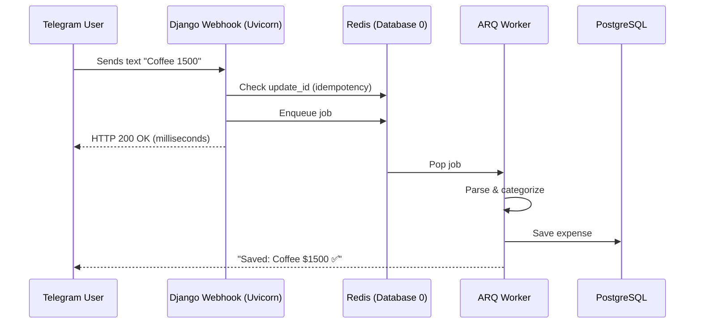

# 💸 SmartExpense

> A personal finance ecosystem combining the immediacy of a Telegram Bot
> with the analytical power of a modern web dashboard — built around an
> asynchronous Producer/Consumer architecture designed for real-world reliability.
>
> Originally built for educational purposes, this project has evolved into
> my primary day-to-day finance tool.
> Try the live version: [@smartexpense_bot](https://web.telegram.org/a/#8478720243)


---

## ⚙️ Key Engineering Decisions

These are the non-obvious design choices that shaped the system.
Full decision records are available in [`docs/decisions/`](docs/decisions/).

### Asynchronous Producer/Consumer Pattern

The core architectural decision. When a user sends a message to the bot,
the webhook receives the payload and **immediately enqueues it to Redis**,
returning `200 OK` to Telegram in milliseconds. A separate ARQ worker process
handles parsing, categorization, and database writes asynchronously.

This matters for two reasons: Telegram marks a bot as unresponsive if it
doesn't receive a `200 OK` within a few seconds, and heavy operations like
DB writes should never block the HTTP cycle.

The webhook is also **idempotent** — Telegram occasionally resends webhooks
on timeout. Each payload carries a unique `update_id`; the system checks
Redis before enqueuing and discards duplicates within a 24-hour window.
This is a deliberate **at-most-once** tradeoff: a lost message the user
can resend is preferable to a duplicated financial record.

### Fault Tolerance

The system is designed to degrade gracefully rather than fail completely:

- **Redis failure at webhook:** returns `200 OK` to prevent Telegram
  retry storms. The message is lost silently — acceptable given the
  alternative is an infinite retry loop that degrades the entire service.
- **Worker job failures:** ARQ retries failed jobs up to 3 times before
  marking them as permanently failed. The full payload is logged on
  final failure for manual recovery.
- **Soft-delete with recovery:** expenses are never hard-deleted immediately.
  A `DeletedObject` table stores a complete JSON snapshot, allowing
  one-click restoration via the Telegram bot within 30 days.

### Self-Learning Categorizer

The categorization engine operates in three confidence tiers:

| Confidence | Source | Action |
|---|---|---|
| ≥ 0.9 | Exact match in user's expense history | Auto-categorize silently |
| ≥ 0.8 | Keyword match in category definitions | Auto-categorize, offer correction |
| ≥ 0.5 | Partial match | Save with suggestion, ask for confirmation |
| < 0.5 | No match | Save as pending, prompt user to choose |

Every correction the user makes is recorded as a `CategorySuggestionFeedback`
entry. On subsequent expenses, the user's own history takes priority over
the global keyword dictionary — the system learns the user's vocabulary
over time.

---

## 🏛️ System Architecture



**Infrastructure is partitioned across Redis databases** to isolate concerns
and prevent cross-contamination between workloads:

| Database | Purpose |
|---|---|
| `db 0` | ARQ job queue (Telegram message processing) |
| `db 1` | Conversation state (pending category creation flows) |
| `db 2` | Reserved for rate limiting and cache |

A single `services/infrastructure/redis_client.py` module manages all
connections — the only place in the codebase that knows how to connect
to Redis.
## 🧪 Test Suite

The test suite covers **151 tests** across all system layers, designed
around explicit contracts rather than implementation details.

Each test module defines what the system *guarantees*, not how it
achieves it. Key examples:

- **Webhook:** verifies idempotency contracts, authentication, and the
  deliberate `200 OK` on Redis failure
- **Service layer:** verifies that updating a category triggers a
  `CategorySuggestionFeedback` record — the side effect that feeds
  the learning loop
- **Categorizer:** verifies that `suggest()` never creates categories
  as a side effect — reads are reads, writes are explicit
- **Selectors:** verifies that pending expenses are invisible to the
  API — a business rule, not a filter

```bash
cd backend
pytest tests/ -v
# 151 passed
```

---

## 📂 Project Structure

```plaintext
smartexpense/
├── backend/
│   ├── apps/
│   │   ├── api/              # Django Ninja REST API + JWT auth
│   │   ├── bot/              # Telegram handlers, webhook, ARQ worker
│   │   └── core/             # Models: User, Expense, Category,
│   │                         # DeletedObject, CategorySuggestionFeedback
│   ├── config/               # Django settings, ASGI config
│   ├── services/
│   │   ├── infrastructure/   # Redis connection pool (single source of truth)
│   │   ├── ml/               # Categorizer, feedback recording, helpers
│   │   ├── parser/           # Natural language expense parser
│   │   ├── expenses.py       # Service layer: create, update, delete, restore
│   │   ├── selectors.py      # Read-only queries
│   │   ├── auth.py           # Magic link token generation
│   │   └── constants.py      # Category colors, emojis, Spanish month map
│   └── tests/
│       ├── api/              # Endpoint integration tests
│       ├── bot/              # Handler, callback, webhook tests
│       └── services/         # Service layer and ML unit tests
├── frontend/
│   └── src/                  # React dashboard
├── docs/
│   ├── decisions/            # Architecture Decision Records (ADRs)
│   └── architecture.md       # Deep dive into system design
└── docker-compose.yml        # PostgreSQL + Redis (local infrastructure only)
```

---

## 🚀 Quick Start (Local Development)

### Prerequisites
- Python 3.12+ (recommended via `pyenv`)
- Docker & Docker Compose
- [Ngrok](https://ngrok.com/) — exposes local server to Telegram webhooks
- Node.js & npm

### 1. Infrastructure

```bash
git clone https://github.com/YOUR_USERNAME/smartexpense.git
cd smartexpense
docker compose up -d db redis
```

> PostgreSQL maps to `:5442` and Redis to `:6389` to avoid conflicts
> with existing local services.

### 2. Backend

```bash
cd backend
python -m venv .venv
source .venv/bin/activate
pip install -r requirements.txt
cp .env.example .env   # fill in TELEGRAM_BOT_TOKEN and secret keys
python manage.py migrate
```

### 3. Run the async ecosystem

Open 3 terminals:

```bash
# Terminal 1 — ASGI server
uvicorn config.asgi:application --reload --port 8000

# Terminal 2 — ARQ background worker
arq apps.bot.worker.WorkerSettings

# Terminal 3 — Webhook tunnel
ngrok http 8000
```

Register your Ngrok URL with Telegram:

```bash
python manage.py set_webhook https://<YOUR_NGROK_URL>.ngrok-free.app
```

---

## 📚 Documentation

| Document | Description |
|---|---|
| [Architecture Deep Dive](docs/architecture.md) | System design, data flow, and component responsibilities |
| [ADR: Producer/Consumer & Idempotency](docs/decisions/idempotency_decision.md) | Webhook design, at-most-once tradeoff |
| [ADR: ARQ Retry & Dead Letter Queue](docs/decisions/arq_retry_decision.md) | Job reliability strategy |
| [ADR: Test Client Conflict Resolution](docs/decisions/testclient_conflict_resolution.md) | How we solved the NinjaAPI/AsyncClient conflict |

---

## 🔭 Roadmap

- **Go API Gateway:** extract the webhook receiver into a Go microservice
  that absorbs Telegram traffic and writes to Redis Streams — freeing
  the Python layer to focus exclusively on business logic and ML inference
- **Rate limiting:** per-user request throttling using the reserved
  Redis `db 2`
- **Worker-level idempotency:** extend the at-most-once guarantee to
  cover ARQ re-enqueue scenarios after worker crashes