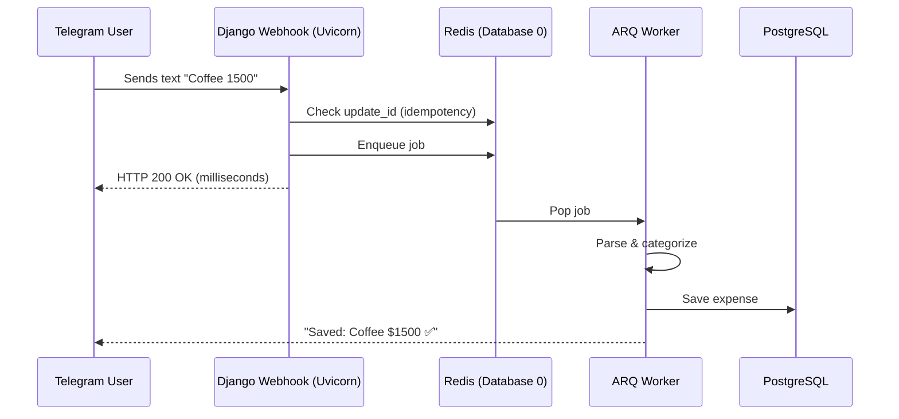

# 💸 SmartExpense

> A personal finance ecosystem combining the immediacy of a Telegram Bot
> with the analytical power of a modern web dashboard — built around an
> asynchronous Producer/Consumer architecture designed for real-world reliability.
>
> Originally built for educational purposes, this project has evolved into
> my primary day-to-day finance tool.
> Try the live version: [@smartexpense_bot](https://web.telegram.org/a/#8478720243)


---

## Key Decisions

These are the non-obvious design choices that shaped the system.
Full decision records are available in [`docs/decisions/`](docs/decision_records/).

### Asynchronous Producer/Consumer Pattern

The core architectural decision. When a user sends a message to the bot,
the webhook receives the payload and **immediately enqueues it to Redis**,
returning `200 OK` to Telegram in milliseconds.
A separate worker process handles parsing, categorization, and database writes asynchronously —powered by ARQ, an async task queue built on Redis (similar to Celery, without the broker overhead).

This matters for two reasons: Telegram marks a bot as unresponsive if it
doesn't receive a `200 OK` within a few seconds, and heavy operations like
DB writes should never block the HTTP cycle.

The webhook is also **idempotent** — Telegram occasionally resends webhooks
on timeout. Each payload carries a unique `update_id`; the system checks
Redis before enqueuing and discards duplicates within a 24-hour window.
This is a deliberate **at-most-once** tradeoff: a lost message the user
can resend is preferable to a duplicated financial record.

### Fault Tolerance

The system is designed to degrade gracefully rather than fail completely:

- **Redis failure at webhook:** returns `200 OK` to prevent Telegram
  retry storms. The message is lost silently — acceptable given the
  alternative is an infinite retry loop that degrades the entire service.
- **Worker job failures:** ARQ retries failed jobs up to 3 times before
  marking them as permanently failed. The full payload is logged on
  final failure for manual recovery.
- **Soft-delete with recovery:** expenses are never hard-deleted immediately.
  A `DeletedObject` table stores a complete JSON snapshot, allowing
  one-click restoration via the Telegram bot within 30 days.

### Soft-Delete with JSON Snapshot

Expenses are never permanently deleted on the first request. Instead, the full object is serialized to JSON and stored in a `DeletedObject` table, and the original record is hard-deleted from `expenses`.

This design has two consequences worth noting:

- **The main table stays clean.** No `is_deleted` flag means no extra filter on every query. The ORM never accidentally returns deleted records.
- **Restoration works even when references break.** If a category is deleted after an expense, the JSON snapshot still contains the category name —   restoration doesn't depend on foreign key integrity.

The tradeoff: the snapshot can go stale if the schema changes. Acceptable at this scale — the alternative (soft-delete flags) adds permanent query complexity for a recovery flow that runs rarely.

Recovery is available for 30 days via the Telegram bot (`↩️ Deshacer` button) and implemented generically via Django's `ContentType` framework — any model can be soft-deleted without additional code.

### Self-Learning Categorizer

The categorization engine operates in three confidence tiers:

| Confidence | Source | Action |
| --- | --- | --- |
| ≥ 0.9 | Exact match in user's expense history | Auto-categorize silently |
| ≥ 0.8 | Keyword match in category definitions | Auto-categorize, offer correction |
| ≥ 0.5 | Partial match | Save with suggestion, ask for confirmation |
| < 0.5 | No match | Save as pending, prompt user to choose |

Every correction the user makes is recorded as a `CategorySuggestionFeedback`
entry. On subsequent expenses, the user's own history takes priority over
the global keyword dictionary — the system learns the user's vocabulary
over time.

---

## 🏛️ System Architecture


```mermaid
sequenceDiagram
    participant User as Telegram User
    participant Webhook as Django Webhook (Uvicorn)
    participant Redis as Redis (Database 0)
    participant Worker as ARQ Worker
    participant DB as PostgreSQL

    User->>Webhook: Sends text "Coffee 1500"
    Webhook->>Redis: Check update_id (idempotency)
    Webhook->>Redis: Enqueue job
    Webhook-->>User: HTTP 200 OK (milliseconds)
    Redis->>Worker: Pop job
    Worker->>Worker: Parse & categorize
    Worker->>DB: Save expense
    Worker-->>User: "Saved: Coffee $1500 ✅"
```

**Infrastructure is partitioned across Redis databases** to isolate concerns
and prevent cross-contamination between workloads:

| Database | Purpose |
| --- | --- |
| `db 0` | ARQ job queue (Telegram message processing) |
| `db 1` | Conversation state (pending category creation flows) |
| `db 2` | Reserved for rate limiting and cache |

A single `services/infrastructure/redis_client.py` module manages all
connections — the only place in the codebase that knows how to connect
to Redis.

## Test Suite

**151 tests** across all system layers, validated automatically on every push via GitHub Actions.

### What's tested and why

Tests are written against **contracts**, not implementations. Each test documents a system guarantee — if the implementation changes but the contract holds, the test should still pass.

| Layer | What's verified |
| --- | --- |
| Webhook | Idempotency contract, auth validation, deliberate `200 OK` on Redis failure. |
| Service layer | Side effects: category changes feed `CategorySuggestionFeedback`. |
| Categorizer | `suggest()` never writes to DB — reads are reads, writes are explicit. |
| Selectors | Pending expenses are invisible to the API — a business rule, not a filter. |
| Auth | Valid/expired/invalid JWT tokens, non-existent users. |

### What's not tested

- **Real Telegram API calls** — all bot tests mock PTB. Testing against the live API would make the suite slow, flaky, and dependent on network access.
- **Frontend** — the React dashboard has no automated tests. Current priority is backend reliability.
- **Worker startup** — the ARQ worker lifecycle (startup/shutdown hooks) is tested manually. Automating this would require a running Redis instance and adds complexity without proportional value at this stage.

```bash
cd backend
pytest tests/ -v
# 151 passed 
```

---

## 📂 Project Structure

```plaintext
smartexpense/
├── backend/
│   ├── apps/
│   │   ├── api/              # Django Ninja REST API + JWT auth
│   │   ├── bot/              # Telegram handlers, webhook, ARQ worker
│   │   └── core/             # Models: User, Expense, Category,
│   │                         # DeletedObject, CategorySuggestionFeedback
│   ├── config/               # Django settings, ASGI config
│   ├── services/
│   │   ├── infrastructure/   # Redis connection pool (single source of truth)
│   │   ├── ml/               # Categorizer, feedback recording, helpers
│   │   ├── parser/           # Natural language expense parser
│   │   ├── expenses.py       # Service layer: create, update, delete, restore
│   │   ├── selectors.py      # Read-only queries
│   │   ├── auth.py           # Magic link token generation
│   │   └── constants.py      # Category colors, emojis, Spanish month map
│   └── tests/
│       ├── api/              # Endpoint integration tests
│       ├── bot/              # Handler, callback, webhook tests
│       └── services/         # Service layer and ML unit tests
├── frontend/
│   └── src/                  # React dashboard
├── docs/
│   ├── decisions/            # Architecture Decision Records (ADRs)
│   └── architecture.md       # Deep dive into system design
└── docker-compose.yml        # Full stack: web, worker, PostgreSQL, Redis
```

---

## Quick Start (Local Development)

### Prerequisites

- Python 3.12+ (recommended via `pyenv`)
- Docker & Docker Compose
- [Ngrok](https://ngrok.com/) — exposes local server to Telegram webhooks
- Node.js & npm

---

### Option A — Full Docker Stack (recommended)

```bash
git clone https://github.com/YOUR_USERNAME/smartexpense.git
cd smartexpense
cp .env.example .env   # fill in TELEGRAM_BOT_TOKEN and secret keys
docker compose up -d
docker compose exec web python manage.py migrate
```

> All four services start with health checks: PostgreSQL, Redis, the Django/Uvicorn server, and the ARQ worker.

Register the webhook with Telegram using Ngrok:

```bash
# Obtain the webhook tunnel
ngrok http 8000

# Register it to Telegram with this command
python manage.py set_webhook https://<YOUR_NGROK_URL>.ngrok-free.app
```

---

### Option B — Manual (database and Redis via Docker, backend local)

```bash
git clone https://github.com/YOUR_USERNAME/smartexpense.git
cd smartexpense
docker compose up -d db redis
```

```bash
cd backend
python -m venv .venv
source .venv/bin/activate
pip install -r requirements.txt
cp .env.example .env   # fill in TELEGRAM_BOT_TOKEN and secret keys
python manage.py migrate
```

Open 3 terminals:

```bash
# Terminal 1 — ASGI server
uvicorn config.asgi:application --reload --port 8000

# Terminal 2 — ARQ background worker (async task queue)
arq apps.bot.worker.WorkerSettings

# Terminal 3 — Webhook tunnel
ngrok http 8000
```

Register the webhook:

```bash
python manage.py set_webhook https://.ngrok-free.app
```

---

## Documentation

| Document | Description |
| --- | --- |
| [Architecture Deep Dive](docs/architecture.md) | System design, data flow, and component responsibilities |
| [ADR: Webhook Idempotency](docs/decision_records/webhook_idempotency.md) | Webhook design, at-most-once tradeoff |
| [ADR: ARQ Retry & Dead Letter Queue](docs/decision_records/arq_retry.md) | Job reliability strategy |
| [ADR: Test Client Conflict Resolution](docs/decision_records/testclient_conflict_resolution.md) | How we solved the NinjaAPI/AsyncClient conflict |

---

## Coming soon

- **Go API Gateway:** extract the webhook receiver into a Go microservice
  that absorbs Telegram traffic and writes to Redis Streams — freeing
  the Python layer to focus exclusively on business logic and ML inference
- **Rate limiting:** per-user request throttling using the reserved
  Redis `db 2`
- **Worker-level idempotency:** extend the at-most-once guarantee to
  cover ARQ re-enqueue scenarios after worker crashes
